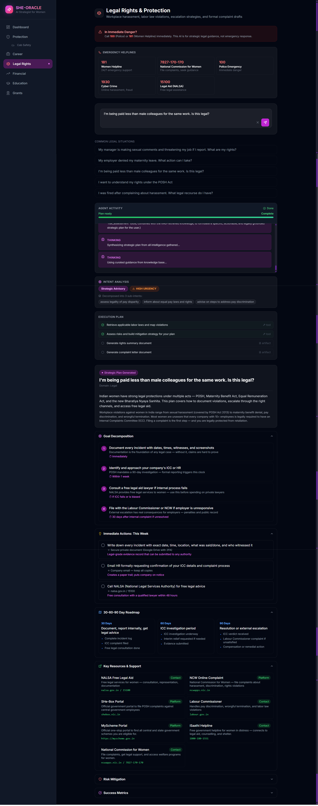
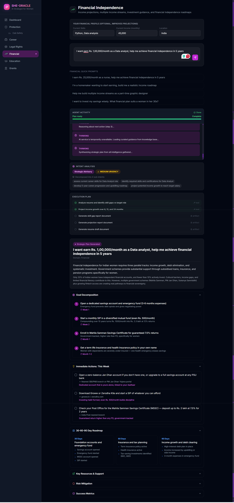
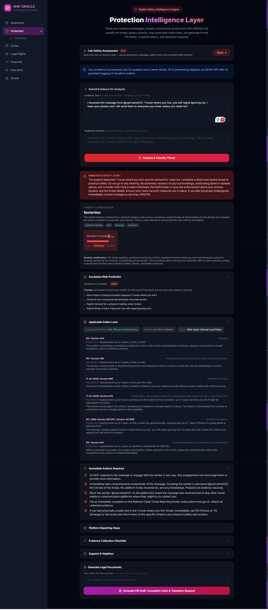

# SHE-ORACLE — Autonomous AI for Women Empowerment

> An autonomous multi-agent AI system that helps women navigate career growth, legal rights, financial independence, education opportunities, and personal safety — powered by Google Gemini and a RAG knowledge base of Indian laws and government schemes.

**Live Demo:** [she-oracle.vercel.app](https://she-oracle.vercel.app)

---

## Features

- **AI Career Advisor** — Resume analysis, skill gap identification, upskilling roadmaps tailored for women in the Indian workforce
- **Legal Rights Assistant** — Instant guidance on POSH Act, Maternity Benefit Act, Equal Remuneration Act, and escalation strategies for workplace harassment
- **Financial Planner** — Income projections, multiple income stream strategies, and financial independence roadmaps
- **Education & Scholarship Finder** — Discovers relevant scholarships, fellowships, and free skill programs from a RAG-indexed knowledge base
- **Government Grants Navigator** — Surfaces applicable government schemes, startup funding, and incubator programs
- **Threat Analyzer** — Classifies digital harassment evidence, maps it to legal sections (IPC/IT Act), and generates severity scores with escalation guidance
- **Legal Document Generator** — Auto-drafts FIR complaints, formal complaint letters, takedown requests, and legal notices
- **Cab Safety Intelligence** — Real-time ride risk scoring with behaviour flag detection, emergency message templates, and helpline contacts
- **ReAct Agent Loop** — Genuine Reasoning + Acting loop: the LLM drives every tool call decision, not a scripted pipeline
- **Streaming Responses** — Real-time SSE streaming so users see the agent thinking step-by-step

---

## Tech Stack

| Layer | Technology |
|---|---|
| Frontend | React 18 + Vite + TailwindCSS |
| Backend | Node.js + Express (API Gateway + SSE Proxy) |
| Orchestrator | Python 3.11 + FastAPI |
| LLM | Google Gemini 2.0 Flash |
| Vector DB | ChromaDB (persistent) |
| Embeddings | Gemini Embedding (`gemini-embedding-001`) |
| Deployment | Vercel (frontend) + Render (backend + orchestrator) |

---

## Screenshots

> _Click on pictures to expand._

| Cab Safety | Career | Legal Rights | Education | Finance | Grants | Protection |
|---|---|---|---|---|---|---|
|  |  |  |  |  |  |  |

---

## Demo Video

> _Add your demo video link here._

[](https://youtube.com)

---

## Architecture

See [`docs/architecture.md`](docs/architecture.md) for full Mermaid diagrams.

```
Browser
  └── Vercel (React Frontend)
        └── /api/* rewrite → Render (Node.js Backend)
                               └── HTTP → Render (Python Orchestrator)
                                            ├── Gemini API  (LLM)
                                            └── ChromaDB    (RAG)
                                                  └── Knowledge Base
                                                        ├── Indian Labor Laws
                                                        ├── Government Schemes
                                                        ├── Scholarships
                                                        ├── Grants & Programs
                                                        └── Cyber Laws
```

**Agent Loop (ReAct):**
1. **Planner** receives user goal + RAG context
2. LLM decides: `CALL_TOOL` or `SYNTHESIZE`
3. Tools execute (`grant_finder`, `legal_rights_checker`, `resume_analyzer`, `income_projection`, `threat_analyzer`, `cab_safety_advisor`, `document_generator`)
4. Observations fed back to LLM, loop repeats
5. **Critic** scores final plan (replans if < 6/10)
6. Plan streams to user via SSE

---

## Installation

### Prerequisites
- Python 3.11+
- Node.js 18+
- Google Gemini API key ([get one free](https://aistudio.google.com/app/apikey))

### 1. Clone the repo
```bash
git clone https://github.com/your-username/she-oracle.git
cd she-oracle
```

### 2. Orchestrator (Python)
```bash
cd orchestrator
python -m venv venv
source venv/bin/activate      # Mac/Linux
# venv\Scripts\activate       # Windows

pip install -r requirements.txt

# Add your API key
cp .env.example .env
# Edit .env and set GEMINI_API_KEY=your_key_here
```

### 3. Backend (Node.js)
```bash
cd backend
npm install
# Create backend/.env with:
# PYTHON_ORCHESTRATOR_URL=http://localhost:8000
```

### 4. Frontend (React)
```bash
cd frontend
npm install
# Create frontend/.env with:
# VITE_API_BASE_URL=http://localhost:3001
```

---

## Running Locally

Start services in this order:

```bash
# Terminal 1 — Orchestrator
cd orchestrator
uvicorn main:app --reload --port 8000

# Terminal 2 — Backend
cd backend
npm start

# Terminal 3 — Frontend
cd frontend
npm run dev
```

Open **http://localhost:5173**

---

## API Documentation

Full API reference: [`docs/api.md`](docs/api.md)

| Endpoint | Method | Description |
|---|---|---|
| `/api/health` | GET | Backend + orchestrator health |
| `/api/agent/stream` | POST | SSE streaming agent response |
| `/api/agent/run` | POST | Non-streaming agent response |
| `/api/session/:id` | GET | Retrieve session memory |
| `/api/protection/analyze-threat` | POST | Threat classification + legal mapping |
| `/api/protection/generate-documents` | POST | Auto-generate legal documents |
| `/api/protection/cab-safety` | POST | Cab ride risk assessment |

---

## Project Structure

```
she-oracle/
├── frontend/               # React + Vite + TailwindCSS
├── backend/                # Node.js Express API Gateway
├── orchestrator/           # Python FastAPI Agent Orchestrator
│   ├── agents/             # Planner, Retriever, Critic, Memory
│   ├── tools/              # Domain tools (career, legal, financial...)
│   ├── rag/                # ChromaDB vector store + embedder
│   └── knowledge/          # Source documents (Indian laws, schemes)
├── docs/                   # Architecture diagrams + API reference
├── .env.example
├── render.yaml             # Render deployment config
└── LICENSE
```

---

## AI Tools Used

- **Google Gemini 2.0 Flash** — Runtime LLM for agent reasoning and tool responses

---

## Team

| Name | Role |
|---|---|
| Anagha P | Frontend, Backend, Orchestrator, Deployment |
| Ameesha | UI/UX, Research, Knowledge Base, Testing |

---

## License

MIT License — see [LICENSE](LICENSE) for details.
