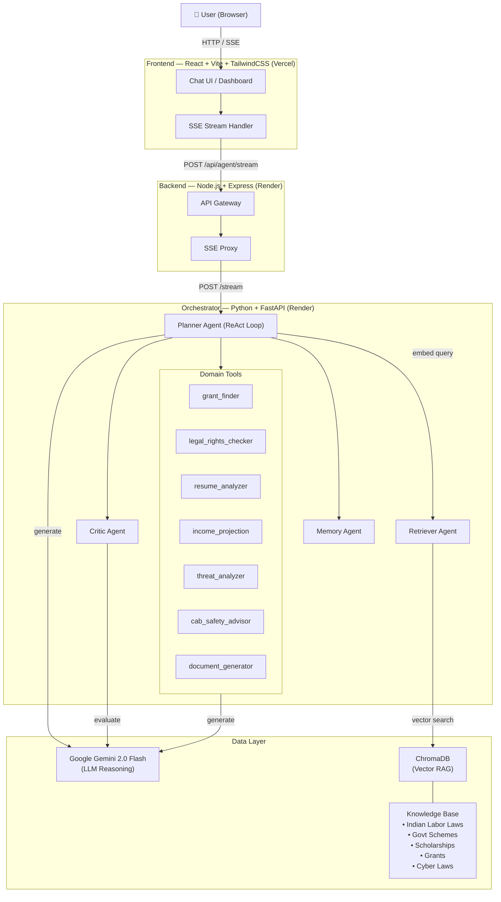
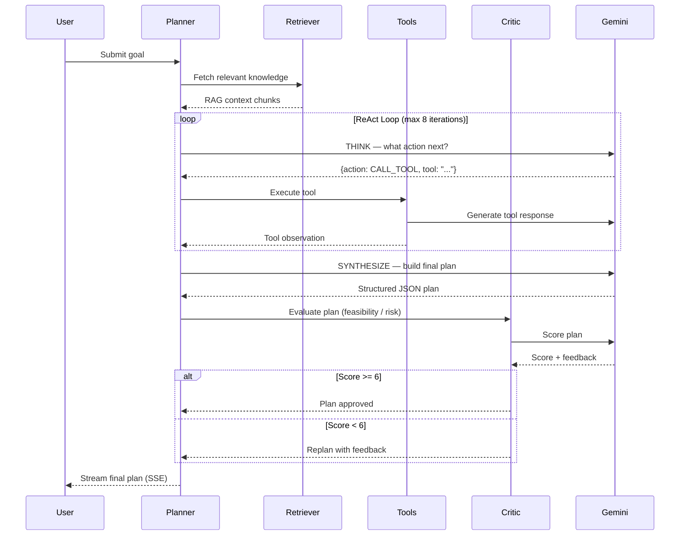
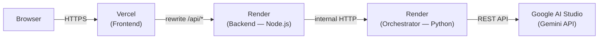

# SHE-ORACLE — Architecture

## System Architecture



## ReAct Agent Loop



## Deployment Architecture



## Folder Structure

```
she-oracle/
├── frontend/               # React + Vite + TailwindCSS
│   ├── src/
│   │   ├── components/     # UI components
│   │   ├── pages/          # Route pages
│   │   └── utils/          # API / SSE helpers
│   └── public/
├── backend/                # Node.js Express API Gateway
│   ├── routes/
│   │   ├── agent.js        # /api/agent — proxies to orchestrator
│   │   ├── session.js      # /api/session — memory management
│   │   └── protection.js   # /api/protection — threat/cab endpoints
│   └── server.js
├── orchestrator/           # Python FastAPI Agent Orchestrator
│   ├── agents/
│   │   ├── planner.py      # ReAct loop (main agent brain)
│   │   ├── retriever.py    # RAG retrieval
│   │   ├── critic.py       # Plan evaluation
│   │   ├── memory.py       # Session memory
│   │   └── intent_analyzer.py
│   ├── tools/              # Domain-specific tools
│   ├── rag/                # ChromaDB + embedder
│   ├── knowledge/          # Source documents (txt)
│   ├── gemini_client.py    # Shared LLM client
│   └── main.py             # FastAPI app + endpoints
└── docs/                   # Architecture diagrams (this folder)
```
