# SHE-ORACLE — Architecture

## System Architecture

```mermaid
graph TB
    User["👩 User (Browser)"]

    subgraph Frontend["Frontend — React + Vite + TailwindCSS (Vercel)"]
        UI["Chat UI / Dashboard"]
        SSE["SSE Stream Handler"]
    end

    subgraph Backend["Backend — Node.js + Express (Render)"]
        GW["API Gateway"]
        Proxy["SSE Proxy"]
    end

    subgraph Orchestrator["Orchestrator — Python + FastAPI (Render)"]
        Planner["Planner Agent (ReAct Loop)"]
        Retriever["Retriever Agent"]
        Critic["Critic Agent"]
        Memory["Memory Agent"]

        subgraph Tools["Domain Tools"]
            T1["grant_finder"]
            T2["legal_rights_checker"]
            T3["resume_analyzer"]
            T4["income_projection"]
            T5["threat_analyzer"]
            T6["cab_safety_advisor"]
            T7["document_generator"]
        end
    end

    subgraph Data["Data Layer"]
        Gemini["Google Gemini 2.0 Flash\n(LLM Reasoning)"]
        ChromaDB["ChromaDB\n(Vector RAG)"]
        KB["Knowledge Base\n• Indian Labor Laws\n• Govt Schemes\n• Scholarships\n• Grants\n• Cyber Laws"]
    end

    User -->|"HTTP / SSE"| UI
    UI --> SSE
    SSE -->|"POST /api/agent/stream"| GW
    GW --> Proxy
    Proxy -->|"POST /stream"| Planner

    Planner -->|"embed query"| Retriever
    Retriever -->|"vector search"| ChromaDB
    ChromaDB --- KB
    Planner -->|"generate"| Gemini
    Planner --> Tools
    Tools -->|"generate"| Gemini
    Planner --> Critic
    Critic -->|"evaluate"| Gemini
    Planner --> Memory
```



## ReAct Agent Loop


## Deployment Architecture

```mermaid
graph LR
    Browser["Browser"]
    Vercel["Vercel\n(Frontend)"]
    Render1["Render\n(Backend — Node.js)"]
    Render2["Render\n(Orchestrator — Python)"]
    GeminiAPI["Google AI Studio\n(Gemini API)"]

    Browser -->|"HTTPS"| Vercel
    Vercel -->|"rewrite /api/*"| Render1
    Render1 -->|"internal HTTP"| Render2
    Render2 -->|"REST API"| GeminiAPI
```



## Folder Structure

```
she-oracle/
├── frontend/               # React + Vite + TailwindCSS
│   ├── src/
│   │   ├── components/     # UI components
│   │   ├── pages/          # Route pages
│   │   └── utils/          # API / SSE helpers
│   └── public/
├── backend/                # Node.js Express API Gateway
│   ├── routes/
│   │   ├── agent.js        # /api/agent — proxies to orchestrator
│   │   ├── session.js      # /api/session — memory management
│   │   └── protection.js   # /api/protection — threat/cab endpoints
│   └── server.js
├── orchestrator/           # Python FastAPI Agent Orchestrator
│   ├── agents/
│   │   ├── planner.py      # ReAct loop (main agent brain)
│   │   ├── retriever.py    # RAG retrieval
│   │   ├── critic.py       # Plan evaluation
│   │   ├── memory.py       # Session memory
│   │   └── intent_analyzer.py
│   ├── tools/              # Domain-specific tools
│   ├── rag/                # ChromaDB + embedder
│   ├── knowledge/          # Source documents (txt)
│   ├── gemini_client.py    # Shared LLM client
│   └── main.py             # FastAPI app + endpoints
└── docs/                   # Architecture diagrams (this folder)
```
